# HamburgueriaUni

Sistema de hamburgueria em Java que demonstra os **23 padrões de projeto GoF**, organizados nas três categorias clássicas: Criacionais, Estruturais e Comportamentais.

---

## Diagrama de Classes

```mermaid
classDiagram
    %% ─────────────────────────────────────────────
    %%  PADRÕES CRIACIONAIS
    %% ─────────────────────────────────────────────

    %% 1. Singleton
    class ConfiguracaoRestaurante {
        -instancia : ConfiguracaoRestaurante
        -taxaEntregaDelivery : double
        +getInstancia()$ ConfiguracaoRestaurante
        +getTaxaEntregaDelivery() double
        +setTaxaEntregaDelivery(taxa)
    }

    %% 2. Abstract Factory
    class FabricaDeIngredientes {
        <<interface>>
        +criarPao() Ingrediente
        +criarProteina() Ingrediente
        +criarQueijo() Ingrediente
        +criarMolho() Ingrediente
        +getCategoria() String
    }
    class FabricaTradicional
    class FabricaVegana
    class FabricaGourmet
    FabricaDeIngredientes <|.. FabricaTradicional
    FabricaDeIngredientes <|.. FabricaVegana
    FabricaDeIngredientes <|.. FabricaGourmet

    %% 3. Flyweight
    class Ingrediente {
        <<interface>>
        +getNome() String
        +getTipo() TipoIngrediente
        +getPreco() double
        +isVegano() boolean
    }
    class IngredienteImpl
    class RepositorioIngredientes {
        -pool : Map~String, Ingrediente~
        +obter(nome, tipo, preco, vegano)$ Ingrediente
        +exibirPool()$
    }
    Ingrediente <|.. IngredienteImpl
    RepositorioIngredientes --> Ingrediente : gerencia pool

    %% 4. Builder
    class LancheBuilder {
        <<interface>>
        +comNome(nome) LancheBuilder
        +comPao(i) LancheBuilder
        +comProteina(i) LancheBuilder
        +comQueijo(i) LancheBuilder
        +comMolho(i) LancheBuilder
        +comExtra(i) LancheBuilder
        +comObservacoes(obs) LancheBuilder
        +construir() Lanche
    }
    class LancheBuilderImpl
    class Lanche {
        -nome : String
        -ingredientes : List~Ingrediente~
        -observacoes : String
        +calcularPreco() double
    }
    LancheBuilder <|.. LancheBuilderImpl
    LancheBuilderImpl --> Lanche : cria

    %% 5. Prototype
    class ItemCardapio {
        <<interface>>
        +getNome() String
        +getPreco() double
        +getDescricao() String
    }
    class CardapioFolha {
        -nome : String
        -preco : double
        +clone() CardapioFolha
        +adicionarIngrediente(i)
    }
    ItemCardapio <|.. CardapioFolha

    %% ─────────────────────────────────────────────
    %%  PADRÕES ESTRUTURAIS
    %% ─────────────────────────────────────────────

    %% 6. Composite
    class CardapioCategoria {
        -nome : String
        -filhos : List~ItemCardapio~
        +adicionar(item)
        +remover(item)
        +exibir()
    }
    class Cardapio {
        -raiz : CardapioCategoria
        +exibir()
        +clonarItem(nome) CardapioFolha
        +getRaiz() CardapioCategoria
    }
    ItemCardapio <|.. CardapioCategoria
    CardapioCategoria o-- ItemCardapio : contém
    Cardapio --> CardapioCategoria

    %% 7. Decorator
    class DecoradorItemCardapio {
        <<abstract>>
        -componente : ItemCardapio
        +getNome() String
        +getPreco() double
        +getDescricao() String
    }
    class DecoradorBacon
    class DecoradorQueijoExtra
    class DecoradorMolhoEspecial
    ItemCardapio <|.. DecoradorItemCardapio
    DecoradorItemCardapio <|-- DecoradorBacon
    DecoradorItemCardapio <|-- DecoradorQueijoExtra
    DecoradorItemCardapio <|-- DecoradorMolhoEspecial
    DecoradorItemCardapio --> ItemCardapio : envolve

    %% 8. Adapter
    class MetodoPagamento {
        <<interface>>
        +processarPagamento(valor) boolean
        +getNomeMetodo() String
    }
    class GatewayPix { +pagar(chave, valor) }
    class GatewayCartao { +cobrar(numero, parcelas, valor) }
    class GatewayDinheiro { +trocar(valorRecebido, total) }
    class AdaptadorPix
    class AdaptadorCartao
    class AdaptadorDinheiro
    MetodoPagamento <|.. AdaptadorPix
    MetodoPagamento <|.. AdaptadorCartao
    MetodoPagamento <|.. AdaptadorDinheiro
    AdaptadorPix --> GatewayPix
    AdaptadorCartao --> GatewayCartao
    AdaptadorDinheiro --> GatewayDinheiro

    %% 9. Bridge
    class FormatoSaida {
        <<interface>>
        +imprimirCabecalho(titulo)
        +imprimirLinha(chave, valor)
        +imprimirRodape()
    }
    class SaidaTerminal
    class SaidaCupom
    class RelatorioPedido {
        -formato : FormatoSaida
        +imprimir(pedido)
    }
    FormatoSaida <|.. SaidaTerminal
    FormatoSaida <|.. SaidaCupom
    RelatorioPedido --> FormatoSaida : delega formato

    %% 10. Proxy
    class EstoqueProxy {
        <<interface>>
        +verificarDisponibilidade(pedido) boolean
    }
    class GerenciadorEstoque
    class ProxyEstoque {
        -cache : Map
        -bloqueado : boolean
        +bloquearAcesso()
        +liberarAcesso()
    }
    EstoqueProxy <|.. GerenciadorEstoque
    EstoqueProxy <|.. ProxyEstoque
    ProxyEstoque --> GerenciadorEstoque : delega

    %% 11. Facade
    class SistemaRestaurante {
        +abrirPedidoMesa(cliente, mesa) Pedido
        +adicionarItem(pedido, item)
        +processarPedido(pedido, pagamento) boolean
        +finalizarPreparoCozinha(pedido)
        +entregarPedido(pedido)
        +imprimirComprovante(pedido, formato)
        +getCardapio() Cardapio
    }
    SistemaRestaurante --> Cardapio
    SistemaRestaurante --> RelatorioPedido
    SistemaRestaurante --> ProxyEstoque

    %% ─────────────────────────────────────────────
    %%  PADRÕES COMPORTAMENTAIS
    %% ─────────────────────────────────────────────

    %% 12. Factory Method + 13. State + 14. Observer
    class Pedido {
        -cliente : String
        -itens : List~ItemCardapio~
        -estadoAtual : EstadoPedido
        -observadores : List~ObservadorPedido~
        +adicionarItem(item)
        +calcularTotal() double
        +pagar()
        +iniciarPreparo()
        +marcarPronto()
        +entregar()
        +cancelar()
        +getStatus() StatusPedido
    }
    class PedidoBalcao
    class PedidoMesa { -numeroMesa : int }
    class PedidoDelivery { -endereco : String }
    class FabricaDePedido {
        <<interface>>
        +criarPedido() Pedido
    }
    class FabricaPedidoBalcao
    class FabricaPedidoMesa
    class FabricaPedidoDelivery
    Pedido <|-- PedidoBalcao
    Pedido <|-- PedidoMesa
    Pedido <|-- PedidoDelivery
    FabricaDePedido <|.. FabricaPedidoBalcao
    FabricaDePedido <|.. FabricaPedidoMesa
    FabricaDePedido <|.. FabricaPedidoDelivery
    FabricaPedidoBalcao --> PedidoBalcao : cria
    FabricaPedidoMesa --> PedidoMesa : cria
    FabricaPedidoDelivery --> PedidoDelivery : cria

    class EstadoPedido {
        <<interface>>
        +pagar()
        +iniciarPreparo()
        +marcarPronto()
        +entregar()
        +cancelar()
    }
    class EstadoNovo
    class EstadoPago
    class EstadoPreparando
    class EstadoPronto
    class EstadoEntregue
    class EstadoCancelado
    EstadoPedido <|.. EstadoNovo
    EstadoPedido <|.. EstadoPago
    EstadoPedido <|.. EstadoPreparando
    EstadoPedido <|.. EstadoPronto
    EstadoPedido <|.. EstadoEntregue
    EstadoPedido <|.. EstadoCancelado
    Pedido --> EstadoPedido : estado atual

    class ObservadorPedido {
        <<interface>>
        +atualizar(pedido)
    }
    class NotificacaoCliente
    class NotificacaoCozinha
    class NotificacaoAtendente
    ObservadorPedido <|.. NotificacaoCliente
    ObservadorPedido <|.. NotificacaoCozinha
    ObservadorPedido <|.. NotificacaoAtendente
    Pedido --> ObservadorPedido : notifica 0..*

    %% 15. Command + 16. Memento
    class ComandoPedido {
        <<interface>>
        +executar()
        +desfazer()
    }
    class ComandoAdicionarItem
    class ComandoRemoverItem
    class ComandoCancelarPedido
    class GerenciadorComandos {
        -historico : Deque~ComandoPedido~
        +executar(cmd)
        +desfazer()
    }
    class PedidoMemento { -snapshot : StatusPedido }
    class HistoricoPedido {
        +salvar(memento)
        +restaurar() PedidoMemento
    }
    ComandoPedido <|.. ComandoAdicionarItem
    ComandoPedido <|.. ComandoRemoverItem
    ComandoPedido <|.. ComandoCancelarPedido
    GerenciadorComandos --> ComandoPedido
    ComandoCancelarPedido --> HistoricoPedido
    HistoricoPedido --> PedidoMemento
    SistemaRestaurante --> GerenciadorComandos

    %% 17. Chain of Responsibility
    class ManipuladorPedido {
        <<abstract>>
        -proximo : ManipuladorPedido
        +processar(pedido) boolean
        +setProximo(h) ManipuladorPedido
    }
    class ValidadorItens
    class ValidadorEstoque
    class ValidadorPagamento
    class ProcessadorCozinha
    ManipuladorPedido <|-- ValidadorItens
    ManipuladorPedido <|-- ValidadorEstoque
    ManipuladorPedido <|-- ValidadorPagamento
    ManipuladorPedido <|-- ProcessadorCozinha
    ValidadorItens --> ValidadorEstoque : próximo
    ValidadorEstoque --> ValidadorPagamento : próximo
    ValidadorPagamento --> ProcessadorCozinha : próximo
    SistemaRestaurante --> ManipuladorPedido

    %% 18. Strategy
    class EstrategiaDesconto {
        <<interface>>
        +aplicar(valor) double
        +descricao() String
    }
    class SemDesconto
    class DescontoFidelidade
    class DescontoHorarioPico
    class DescontoProgressivo { -pedidosNoMes : int }
    EstrategiaDesconto <|.. SemDesconto
    EstrategiaDesconto <|.. DescontoFidelidade
    EstrategiaDesconto <|.. DescontoHorarioPico
    EstrategiaDesconto <|.. DescontoProgressivo

    %% 19. Template Method
    class PreparacaoLanche {
        <<abstract>>
        +preparar(lanche)
        #aquecer(lanche)*
        #montar(lanche)*
        #finalizar(lanche)*
    }
    class PreparacaoTradicional
    class PreparacaoVegana
    class PreparacaoGourmet
    PreparacaoLanche <|-- PreparacaoTradicional
    PreparacaoLanche <|-- PreparacaoVegana
    PreparacaoLanche <|-- PreparacaoGourmet

    %% 20. Iterator
    class IteradorCardapio {
        -pilha : Deque~ItemCardapio~
        +hasNext() boolean
        +next() CardapioFolha
        +totalItens() int
    }
    IteradorCardapio --> CardapioCategoria : percorre

    %% 21. Visitor
    class Visitante {
        <<interface>>
        +visitar(CardapioFolha)
        +visitar(CardapioCategoria)
    }
    class Visitavel {
        <<interface>>
        +aceitar(visitante)
    }
    class RelatorioPrecos { +imprimirRelatorio() }
    class RelatorioVegano { +imprimirRelatorio() }
    Visitante <|.. RelatorioPrecos
    Visitante <|.. RelatorioVegano
    Visitavel <|.. CardapioFolha
    Visitavel <|.. CardapioCategoria
    Visitante --> Visitavel : visita

    %% 22. Mediator
    class CozinhaMediator {
        <<interface>>
        +enviarMensagem(remetente, msg)
        +registrar(colaborador)
    }
    class CentralCozinha
    class ColaboradorCozinha {
        <<abstract>>
        -mediator : CozinhaMediator
        +enviar(msg)
        +receber(msg)*
    }
    class Atendente { +abrirPedido(desc)\n+entregarPedido(desc) }
    class Cozinheiro { +finalizarPedido(desc) }
    class ClienteColaborador
    CozinhaMediator <|.. CentralCozinha
    ColaboradorCozinha <|-- Atendente
    ColaboradorCozinha <|-- Cozinheiro
    ColaboradorCozinha <|-- ClienteColaborador
    CentralCozinha --> ColaboradorCozinha : coordena
    ColaboradorCozinha --> CozinhaMediator : usa

    %% 23. Interpreter
    class ExpressaoPersonalizacao {
        <<interface>>
        +interpretar(contexto)
    }
    class ExpressaoPonto
    class ExpressaoSemIngrediente
    class ExpressaoComAdicional
    class InterpretadorPedido {
        +interpretar(texto)
    }
    class ContextoPersonalizacao {
        -instrucoes : List~String~
    }
    ExpressaoPersonalizacao <|.. ExpressaoPonto
    ExpressaoPersonalizacao <|.. ExpressaoSemIngrediente
    ExpressaoPersonalizacao <|.. ExpressaoComAdicional
    InterpretadorPedido --> ExpressaoPersonalizacao : usa
    InterpretadorPedido --> ContextoPersonalizacao
```

---
